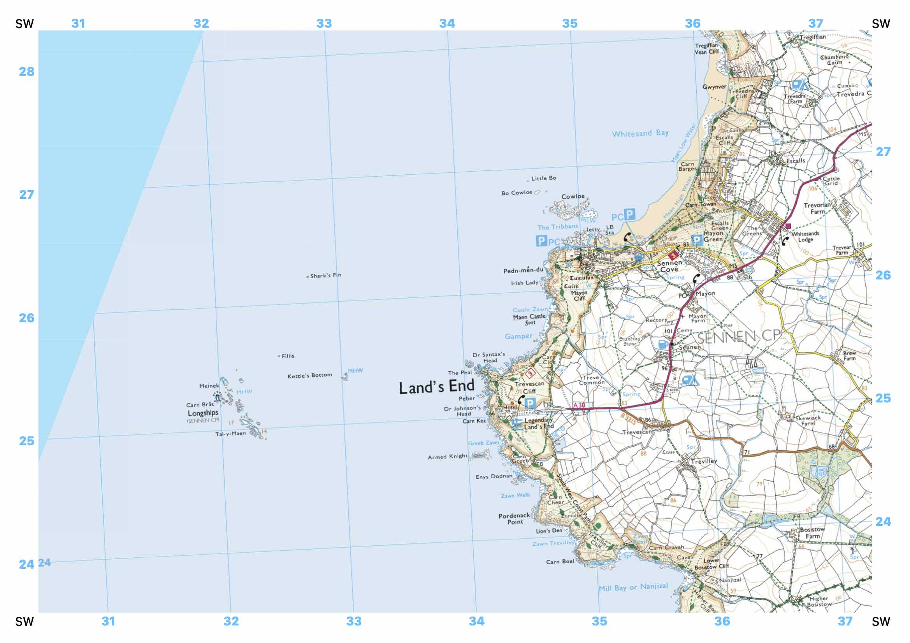

# Atlas

Prepare maps for printing, using online slippy maps, such as Bing Maps’s [Quadkey](https://docs.microsoft.com/en-us/bingmaps/articles/bing-maps-tile-system) and generic [ZXY](https://wiki.openstreetmap.org/wiki/Slippy_map_tilenames) tiles, and showing [OS grid references](https://en.wikipedia.org/wiki/Ordnance_Survey_National_Grid).

Every tile fetched is permanently cached.

For best results, view in Firefox.

## Usage

Atlas is written in Ruby 2.7, so you will need to install it if you haven’t already.
Use `bundle install` to install the dependencies.

Clone the file `atlasrc.yaml.sample` into `atlasrc.yaml`.

Run the server
```
./atlas.rb
```

Or with live reloading for development, using [`entr`](http://eradman.com/entrproject/):

```
ls ./atlas* | entr -r ./atlas.rb
```

This can then be browsed at `http://localhost:5000/?center=NY%2017125%2012104`.

The `center` argument is an OS grid reference, or comma-separated list thereof (one per page to be printed).

At the top of the page there are controls for specifying which map to display.

### Terminal usage

`./atlas.rb`: serve a web server, as detailed above.

`./atlas.rb TL123456`: display the map in a terminal, using [iTerm](https://www.iterm2.com)’s [image API](https://www.iterm2.com/documentation-images.html).

The port can be set using the environment variable `ATLAS_PORT`, otherwise it will default to 5000. The address to serve to is given by `ATLAS_ADDRESS`, or defaults to `127.0.0.1` (localhost only). Use `0.0.0.0` to serve to everyone.

The configuration file can be specified using the environment variable `ATLAS_RC`, otherwise it will default to `./atlasrc.yaml`.

If `ATLAS_OFFLINE` is nonempty, no tiles will be fetched, and only the tiles already cached will be served.

### HTTP Arguments

| **Query** | **Default** | **Description** |
|-|-|-|
| `style` | | The namespace of the tile server to use. This defaults to the first tile server in your `atlasrc.yaml` file. |
| `scale` | 4 | Number of centimetres printed for each kilometre on the map. |
| `paper` | A4 | `A3`, `A4` or `A5`, or `A3-portrait` etc. This may have to be specified when printing too. |
| `margin` | 0.5 | How many centimetres of border to leave around the page. |
| `center` |  | A comma-separated list of pages to print, given as OS grid references of their center point. This is required unless `fit` is given instead. |
| `fit` |  | A comma-separated list of points to print. A bounding rectangle will be calculated, and every page in this rectangle will be printed. |
| `padding` | 0 | Include a minimum of `padding` kilometres around each of the provided points in `fit`. This has no effect if `fit` is not given. |
| `partial` |  | If present, do not serve the `<head>`, only the new container. This allows AJAX requests for more maps, via the `addMap()` function. |
| `grid_lines` | Whether or not to superimpose OS grid lines over the map (`true` or `false`, otherwise defaults to the value given in the tileserver config). |
| `grid_north` | Whether or not to rotate the map such that OS grid lines run exactly vertically (`true` or `false`, otherwise defaults to the value given in the tileserver config). |

### `atlasrc.yaml` config

This file contains an array of objects, each specifying a tile server source.

| Key | Description |
|-|-|
| `type` | The tile coordinate system to use, either `quadkey` or `zxy`. |
| `url` | The URL of a tile, with the tile id replaced by `%s` (for quadkey), or by `{z}`, `{x}` and `{y}` for zxy maps. In the latter case, `{a|b|c}` etc may also be used to randomize the source. |
| `id` | The unique name to identify the style by, as will be used in tile links. |
| `title` | The user-facing name to identify the style as, as seen in the dropdown. |
| `folder` | The local folder on the server to cache these tiles in. This may be shared, but only when the tile identifiers are distinct. |
| `zoom` | The default zoom level to request the tiles at. Defaults to 14. If `zooms` is specified and `zoom` does not fall within it, the nearest value in `zooms` is taken. |
| `zooms` | An array or range (e.g. `!ruby/range 12..16`) of valid zoom levels. Defaults to `8..16`. |
| `grid_lines` | Whether or not to superimpose OS grid lines over the map, by default. |
| `grid_north` | Whether or not to rotate the map such that OS grid lines run exactly vertically, by default. |

## Sample

`/?center=SW 341 254`


